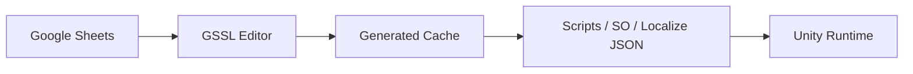

# Google SpreadSheet Loader

Unity 에디터 확장으로, **Google Spreadsheet를 단일 소스**로 두고 테이블·Enum·다국어 JSON을 자동 생성합니다.


이 문서는 사람용 사용 가이드입니다. Cursor 에이전트용 스킬·룰 원문은 레포의 `.cursor/`에 있으며 GitBook에는 올리지 않습니다.


## 이런 분께

- Unity 프로젝트에서 기획 시트를 코드·에셋으로 동기화하고 싶을 때
- 스프레드시트를 공개하지 않고도 API로 내리고 싶을 때 (서비스 계정)
- AI 에이전트가 시트만 골라 갱신하는 흐름이 필요할 때

## 주요 기능

| 기능 | 요약 |
|------|------|
| 서비스 계정 인증 | 비공개 시트도 공유만으로 다운로드 |
| 테이블 코드젠 | `변수명-타입` 헤더 → C# / ScriptableObject |
| Enum 생성 | EnumDef 시트 → Enum 클래스 |
| Localization | 언어 열 → `Localize_*.json` |
| Agent 동기화 | pending JSON + `Tools/GSSL/Sync Pending Sheets` |

## 빠른 경로

1. [설치](getting-started/install.md)
2. [서비스 계정 설정](getting-started/service-account.md)
3. [첫 다운로드](getting-started/first-download.md)

더 자세한 개념은 [데이터 흐름](concepts/data-flow.md), 실무 팁은 [How-to](how-to/sheet-formatting.md)를 보세요.

## 요구사항

- Unity **6000.2** 이상 (`Awaitable` API)
- Google Cloud **서비스 계정** JSON (Sheets API 활성화)
- Newtonsoft.Json (`com.unity.nuget.newtonsoft-json`)

## 레포

소스와 이슈: [cyKim0115/GoogleSpreadSheetLoader](https://github.com/cyKim0115/GoogleSpreadSheetLoader)
