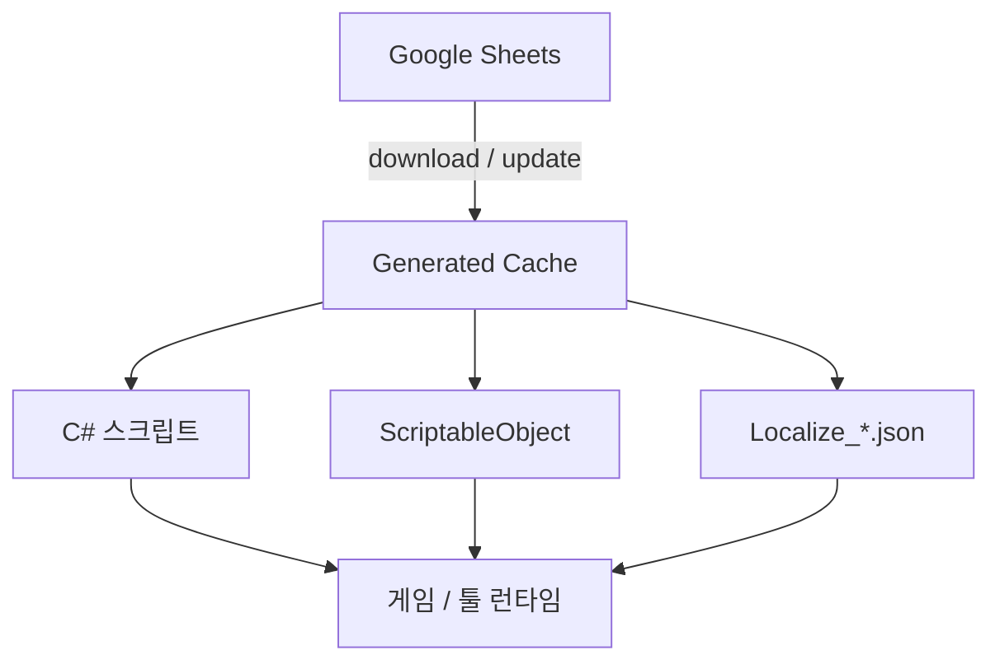

# 데이터 흐름

GSSL에서 **진실의 원천(source of truth)** 은 항상 Google Sheets입니다. Unity 쪽 생성물은 그 스냅샷입니다.

## 수동(에디터 UI) 경로

1. SettingData에 스프레드시트·서비스 계정 설정
2. Open Window에서 다운로드
3. 캐시 갱신 후 코드젠·에셋 생성

## Agent(선택 동기화) 경로

1. Cache로 스키마만 **읽기**
2. Sheets에서 값·서식 수정 (MCP 또는 브라우저)
3. `.cursor/gssl-pending.json`에 대상 시트 기록
4. `Tools/GSSL/Sync Pending Sheets`
5. `.cursor/gssl-result.json`으로 성공 확인
6. **생성물 diff만** 커밋

상세: [Agent 동기화](../how-to/agent-sync.md)

## 왜 Cache를 직접 고치면 안 되나

다음 sync에서 GSSL이 Cache·JSON·스크립트를 다시 쓰므로, 손으로 넣은 값은 **통째로 덮어써집니다**.  
고치고 싶은 데이터는 시트에 반영한 뒤 sync 하세요. → [생성물과 금지 사항](generated-outputs.md)
